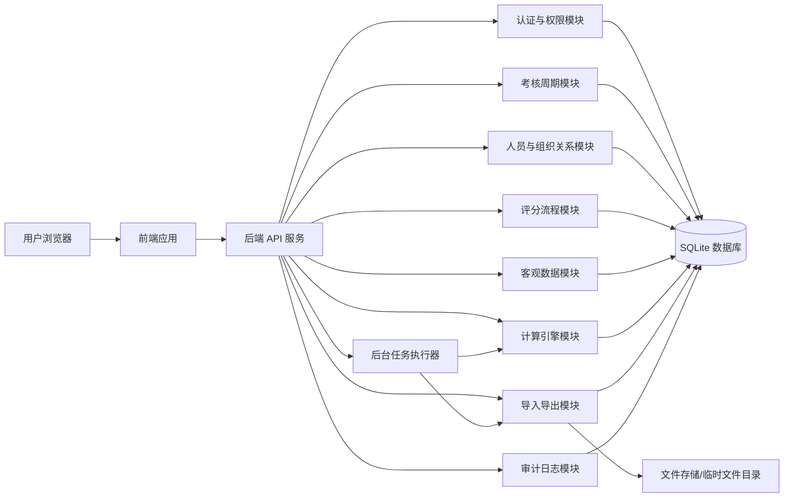
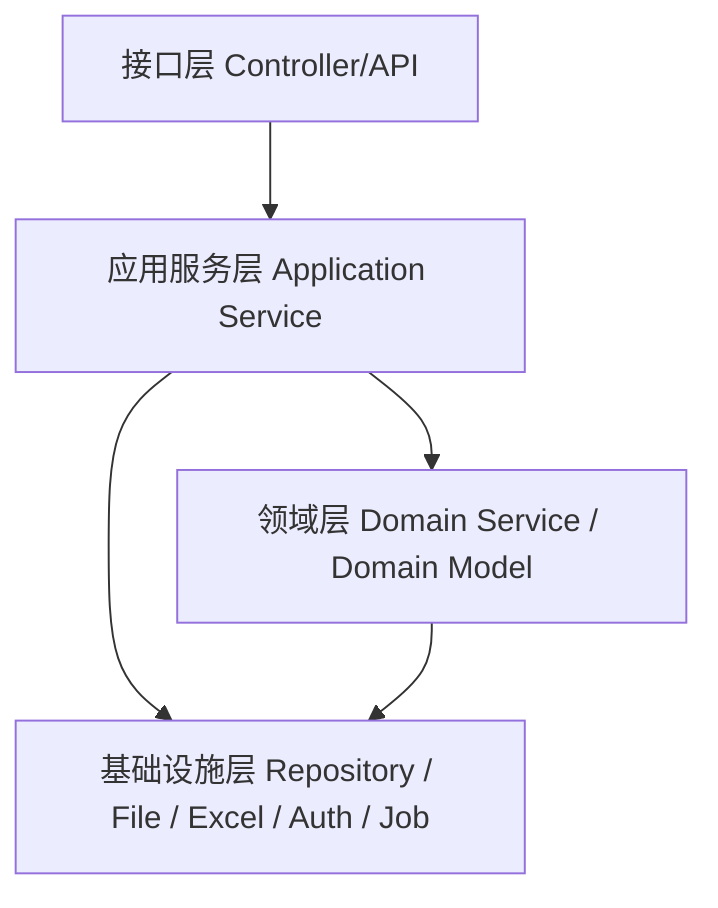
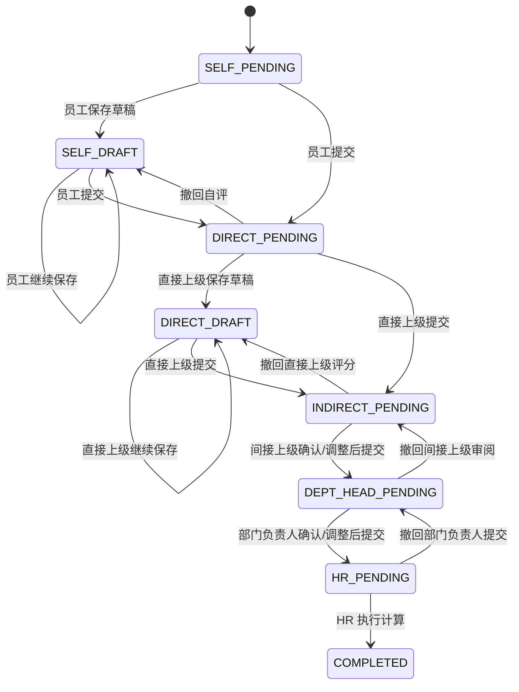
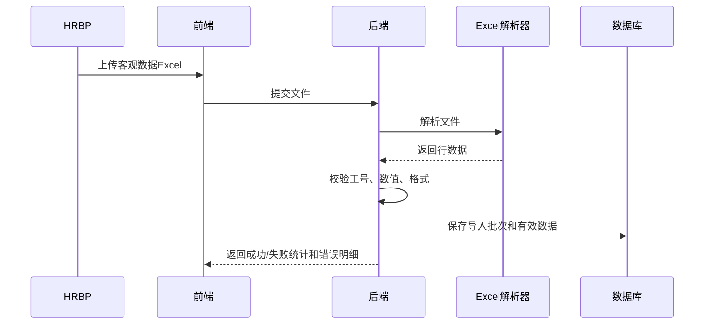
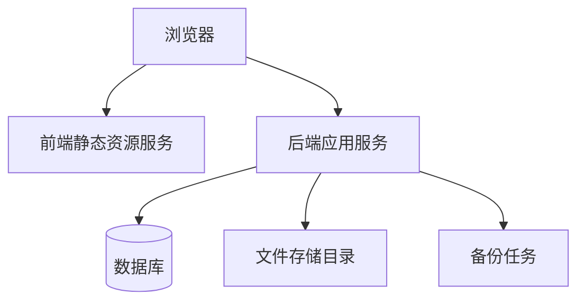
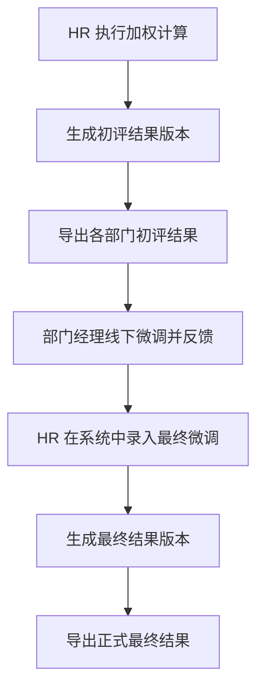

# 季度绩效考核评分工具 V1 方案与架构设计

- 来源 PRD：`季度绩效考核评分工具_PRD_V1.md`
- 设计日期：2026-06-16
- 文档状态：本地设计稿，尚未提交 Git
- 设计原则：技术栈中立、V1 快速落地、模块边界清晰、规则可测试、全链路可追溯

## 1. 设计目标

本系统 V1 的目标是把季度绩效考核中的核心流程线上化：

> 人员导入 → 员工自评 → 直接上级评分 → 间接上级审阅 → 部门负责人确认 → HR 导入客观数据 → 自动计算 → 结果导出

设计重点不是建设完整绩效平台，而是优先解决 PRD 中的核心痛点：

1. 减少 Excel 拆分、合并、复制粘贴和反复核对。
2. 自动完成等级映射、加权计算、分组排名和定级。
3. 保证提交、撤回、调整均有审计留痕。
4. 支持不同角色按职责范围访问数据。
5. 支持最终结果 Excel 导出，兼容现有线下归档流程。

## 2. V1 范围边界

### 2.1 V1 包含

| 模块 | 是否包含 | 说明 |
|---|---:|---|
| 账号密码登录 | 是 | V1 不接 SSO |
| 考核周期管理 | 是 | 创建、启动、关闭、删除未启动周期 |
| 人员名单导入 | 是 | Excel 导入员工、部门、上下级关系 |
| 员工自评 | 是 | 工作总结 + 3 个主观维度自评 |
| 直接上级评分 | 是 | 查看自评，填写 3 个主观维度评分和评语 |
| 间接上级审阅 | 是 | 查看团队初评、比例校验、调整并留痕 |
| 部门负责人确认 | 是 | 查看部门全员、比例校验、最终确认并留痕 |
| 客观数据导入 | 是 | 勤奋、纪律、学习数据导入和等级转换 |
| 加权计算 | 是 | 分数映射、权重计算、分组排序、百分比定级 |
| 结果导出 | 是 | 导出 Excel |
| 审计日志 | 是 | 提交、撤回、调整、导入、计算、导出均记录 |

### 2.2 V1 不包含

| 模块 | 处理方式 |
|---|---|
| 在线结果发布 | 线下发布，V2+ 再建设 |
| 申诉机制 | V2+ 建设 |
| 目标责任书 | V2+ 建设 |
| 钉钉组织架构对接 | V2+ 建设 |
| 复杂高可用架构 | V1 以简单可靠部署为主 |
| 可配置评分体系 | V1 固化规则，V2+ 再配置化 |

## 3. 总体方案

推荐采用：

> 前后端分离 + Python Flask 模块化单体后端 + SQLite + 文件存储 + 后台任务能力

“模块化单体”表示部署上是一个后端服务，代码内部按领域模块拆分。该方案适合 V1 的原因：

- PRD 规模较小：同时在线约 50 人，单次导入和导出约 200 条数据。
- 业务强一致：评分状态、调整留痕、计算结果需要在事务中保证一致。
- V1 目标是快速落地，不适合过早引入微服务复杂度。
- 后续 V2/V3 可基于清晰模块边界逐步拆分。

V1 默认技术选型：

| 层级 | 技术选型 | 说明 |
|---|---|---|
| 后端 | Python + Flask | 适合快速交付内部管理工具；按模块组织蓝图、服务和仓储代码 |
| 数据库 | SQLite | 适合 200 人规模、低并发写入和轻量部署；通过事务保证评分、调整和审计日志一致性 |
| 前端 | HTML/CSS/JavaScript 或轻量模板 | PC 端优先，页面结构以表单、表格、弹窗和导入导出操作为主 |
| 文件处理 | Python Excel 读写库 | 用于人员、客观数据导入和结果导出 |
| 部署 | 单机应用 + 本地文件目录 | Flask 服务、SQLite 数据库文件、导入导出文件和备份脚本部署在同一受控环境 |

SQLite 使用边界：V1 可采用 SQLite；如果后续出现多人高并发写入、跨部门长期并行考核、复杂报表分析或更严格的数据库运维要求，再迁移到 PostgreSQL/MySQL。

### 3.1 总体架构图



## 4. 后端分层设计

后端建议按四层组织：



### 4.1 接口层

职责：

- 接收前端请求。
- 参数校验。
- 认证鉴权。
- 返回统一响应结构。
- 不承载复杂业务规则。

### 4.2 应用服务层

职责是编排业务用例，例如：

- 创建考核周期。
- 导入人员名单。
- 员工提交自评。
- 直接上级提交评分。
- 间接上级提交审阅。
- 部门负责人确认提交。
- HR 执行计算。
- 导出结果 Excel。

### 4.3 领域层

承载核心业务规则：

- 状态机流转规则。
- 角色数据范围规则。
- 评分等级映射规则。
- 权重计算规则。
- 排名百分比映射规则。
- 客观数据转换规则。
- 调整记录不可删除规则。

### 4.4 基础设施层

负责技术能力：

- 数据库访问。
- Excel 解析与生成。
- 文件临时存储。
- 密码哈希。
- 审计日志写入。
- 后台任务执行。
- 数据备份对接。

## 5. 核心业务模块设计

## 5.1 认证与权限模块

### 5.1.1 角色

| 角色编码 | 名称 | 说明 |
|---|---|---|
| EMPLOYEE | 被考核员工 | 填写本人自评 |
| DIRECT_MANAGER | 直接上级 | 给直接下属评分 |
| INDIRECT_MANAGER | 间接上级 | 审阅管辖团队 |
| DEPT_HEAD | 部门负责人 | 确认部门最终评分 |
| HRBP | HR 数据处理员 | 导入客观数据、计算、导出 |
| ADMIN | 管理员 | 周期、人员、参数维护 |

一个用户可以拥有多个角色。例如部门负责人也可能同时是某些员工的直接上级。

### 5.1.2 权限模型

采用：

> RBAC 角色权限 + 数据范围权限

不能只判断“有没有角色”，还要判断“能访问哪些数据”。

| 操作 | 权限判断 |
|---|---|
| 查看本人自评 | `record.emp_id == current_user.emp_id` |
| 查看直接下属 | `record.direct_manager_id == current_user.emp_id` |
| 查看间接团队 | `record.indirect_manager_id == current_user.emp_id` |
| 查看部门全员 | `record.dept_head_id == current_user.emp_id` |
| HR 查看全量 | 当前用户拥有 HRBP 或 ADMIN |
| 管理周期 | ADMIN |
| 导入人员 | HRBP 或 ADMIN |
| 执行计算 | HRBP |
| 导出结果 | HRBP |

## 5.2 考核周期模块

### 5.2.1 周期状态

| 状态 | 说明 |
|---|---|
| PREPARING | 准备中，可导入人员 |
| ACTIVE | 进行中，员工和管理者可操作 |
| CLOSED | 已关闭，只读 |

### 5.2.2 周期规则

1. 同一时间建议只允许一个 ACTIVE 周期。
2. 周期启动前必须完成参与人员导入。
3. 周期关闭后所有记录只读。
4. 未启动周期可删除；已启动周期建议只允许关闭，不物理删除。

## 5.3 人员与组织关系模块

人员名单来自 Excel 导入。

### 5.3.1 核心能力

1. 下载人员导入模板。
2. 上传人员 Excel。
3. 校验必填字段。
4. 校验工号唯一。
5. 校验直接上级、间接上级、部门负责人是否存在。
6. 按工号做增量更新。
7. 为当前周期生成考核记录。

### 5.3.2 人员快照设计

建议在考核周期内保存人员快照。

原因：

- 员工部门或上级关系可能在季度内变化。
- 绩效流程需要按本周期导入时的关系流转。
- 避免后续组织关系变更影响历史考核数据。

| 数据 | 说明 |
|---|---|
| employee_master | 当前人员主数据 |
| cycle_employee_snapshot | 某个考核周期内的人员快照 |

## 5.4 评分流程模块

### 5.4.1 记录状态

PRD 中状态名称较口语化，落地时建议规范成枚举：

| 状态编码 | 中文名 | 说明 |
|---|---|---|
| SELF_PENDING | 待自评 | 系统生成记录后的初始状态 |
| SELF_DRAFT | 自评草稿 | 员工保存但未提交 |
| DIRECT_PENDING | 待直接上级评分 | 员工已提交自评 |
| DIRECT_DRAFT | 直接上级评分草稿 | 直接上级保存但未提交 |
| INDIRECT_PENDING | 待间接上级审阅 | 直接上级已提交 |
| DEPT_HEAD_PENDING | 待部门负责人审阅 | 间接上级已提交 |
| HR_PENDING | 待 HR 计算 | 部门负责人已提交 |
| COMPLETED | 已完成 | HR 已完成计算 |

### 5.4.2 状态流转图



### 5.4.3 状态流转原则

1. 提交即锁定。
2. 已提交内容不能由提交人自行修改。
3. 撤回必须记录原因。
4. 撤回后回到对应草稿或待处理状态。
5. HRBP 拥有最高撤回权限。
6. 调整记录不可删除，只能追加。

## 5.5 主观评分设计

PRD 中存在一个实现前需要明确的点：

- 一处描述要求直接上级对 3 个主观维度分别评分。
- 另一处描述间接上级、部门负责人调整的是“建议等级/最终等级”。
- 数据字段又包含 `final_subjective_grade_{1,2,3}`。

为了保证加权计算可执行，V1 建议采用以下设计。

### 5.5.1 直接上级评分

直接上级必须填写：

- 主观维度 1 等级。
- 主观维度 2 等级。
- 主观维度 3 等级。
- 整体评语。
- 初始建议总等级，可自动计算或手工选择。

### 5.5.2 间接上级与部门负责人调整

支持两类调整：

| 调整类型 | 说明 |
|---|---|
| 维度级调整 | 修改某个主观维度最终等级，用于加权计算 |
| 综合建议等级调整 | 修改展示和比例校验用的建议等级 |

为降低 V1 操作复杂度，前端默认展示“综合建议等级调整”，详情页允许展开修改 3 个主观维度最终等级。

最终用于加权计算的是：

```text
final_subjective_grade_1
final_subjective_grade_2
final_subjective_grade_3
```

如果部门负责人没有修改，则默认继承直接上级评分。

## 5.6 比例校验模块

### 5.6.1 设计原则

1. 比例校验是提示，不是强制拦截。
2. 管理序列不纳入员工序列比例校验。
3. 系统展示当前值、参考值、偏差值。
4. 超出容差时高亮提示。
5. 不阻止提交。

### 5.6.2 参考比例

| 等级 | 参考值 | 容差 |
|---|---:|---:|
| A+ | 5% | ±2% |
| A | 15% | ±3% |
| B+ | 30% | ±5% |
| B | 35% | ±5% |
| B- | 10% | ±3% |
| C+D | 5% | ±2% |

### 5.6.3 校验对象

| 阶段 | 校验范围 |
|---|---|
| 间接上级审阅 | 当前间接上级管辖范围内的非管理序列人员 |
| 部门负责人审阅 | 当前部门下非管理序列人员 |
| HR 结果总览 | 全体非管理序列人员，可按分组查看 |

## 5.7 客观数据模块

客观数据包括勤奋、纪律、学习。

### 5.7.1 导入流程



### 5.7.2 勤奋等级转换

PRD 文案中同时出现“季度勤奋点数合计”和“月均勤奋点数”。设计上采用：

- 导入保存季度合计值。
- 系统计算月均值：`季度合计 / 3`。
- 等级按月均值判断。

| 月均勤奋点数 | 等级 |
|---|---|
| `< 11` | D |
| `>= 11 且 < 40` | C |
| `>= 40 且 < 60` | B |
| `>= 60` | A |

### 5.7.3 纪律等级转换

| 季度异常次数 | 等级 |
|---|---|
| 0-3 | A+ |
| 4-6 | A |
| 7-9 | B |
| 10-12 | C |
| >=13 | D |

### 5.7.4 学习等级转换

学习按同一分组内培训时长排名百分比转换。

排序规则：

1. 同一分组内按培训时长倒序。
2. 培训时长相同则按工号升序稳定排序。
3. 百分比计算：`排名 / 分组总人数 * 100`。
4. 再映射等级。

## 5.8 计算引擎模块

计算引擎是独立领域模块，不应散落在页面或接口里。

### 5.8.1 输入

- 人员所属分组。
- 3 个最终主观维度等级。
- 客观维度等级。
- 分组权重配置。
- 等级分值映射。

### 5.8.2 输出

- 每个维度的等级。
- 每个等级对应分值。
- 每个维度权重。
- 每个维度加权贡献值。
- 加权总分。
- 组内排名。
- 组内总人数。
- 排名百分比。
- 系统建议等级。
- 最终等级。

### 5.8.3 等级分值映射

| 等级 | 分值 |
|---|---:|
| A+ | 100 |
| A | 93 |
| B+ | 86 |
| B | 80 |
| B- | 70 |
| C | 60 |
| D | 50 |

### 5.8.4 权重配置

| 维度 | 管理序列 | 员工序列 P4-10 | 员工序列 P1-3 |
|---|---:|---:|---:|
| 主观维度1 | 20% | 30% | 30% |
| 主观维度2 | 30% | 25% | 20% |
| 主观维度3 | 30% | 30% | 30% |
| 勤奋 | 10% | 5% | 10% |
| 纪律 | 5% | 5% | 5% |
| 学习 | 5% | 5% | 5% |

### 5.8.5 计算公式

```text
weighted_score =
  subjective_1_score * weight_1
+ subjective_2_score * weight_2
+ subjective_3_score * weight_3
+ diligence_score * diligence_weight
+ discipline_score * discipline_weight
+ learning_score * learning_weight
```

最终保留 1 位小数。

### 5.8.6 排名与定级

规则：

1. 按分组分别排序：
   - 管理序列。
   - 员工序列 P1-3。
   - 员工序列 P4-10。
2. 按加权总分倒序。
3. 分数相同按工号升序稳定排序。
4. 计算排名百分比：`rank_pct = rank_in_group / rank_total * 100`。
5. 映射等级。

| 排名百分比 | 等级 |
|---|---|
| <= 5% | A+ |
| >5% 且 <=20% | A |
| >20% 且 <=50% | B+ |
| >50% 且 <=85% | B |
| >85% 且 <=95% | B- |
| >95% 且 <=98% | C |
| >98% | D |

## 6. 核心数据模型设计

以下为逻辑数据模型，V1 默认以 SQLite 落地；字段类型可按 SQLite 的 INTEGER、REAL、TEXT、JSON 文本约定实现。

## 6.1 用户与权限

### user_account

| 字段 | 说明 |
|---|---|
| id | 用户账号 ID |
| emp_id | 关联员工工号 |
| username | 登录名 |
| password_hash | 密码哈希 |
| status | 启用/禁用 |
| last_login_at | 最近登录时间 |
| created_at | 创建时间 |

### user_role

| 字段 | 说明 |
|---|---|
| id | 主键 |
| user_id | 用户 ID |
| role_code | 角色编码 |

## 6.2 考核周期

### evaluation_cycle

| 字段 | 说明 |
|---|---|
| id | 周期 ID |
| cycle_name | 周期名称，如 2026-Q2 |
| start_date | 开始日期 |
| end_date | 结束日期 |
| status | PREPARING / ACTIVE / CLOSED |
| created_by | 创建人 |
| created_at | 创建时间 |

## 6.3 人员快照

### cycle_employee_snapshot

| 字段 | 说明 |
|---|---|
| id | 主键 |
| cycle_id | 周期 ID |
| emp_id | 工号 |
| emp_name | 姓名 |
| sequence | 管理序列 / 员工序列 |
| level | 实际职级：P1 / P2 / P3 / P4 / P5 / P6 / P7 / P8 / P9 / P10 / 不适用；员工序列填写具体职级，管理序列填不适用 |
| group_code | 计算分组：MANAGEMENT / EMPLOYEE_P1_3 / EMPLOYEE_P4_10，由系统根据 sequence + level 派生 |
| dept_name | 部门 |
| direct_manager_id | 直接上级工号 |
| indirect_manager_id | 间接上级工号 |
| dept_head_id | 部门负责人工号 |
| active | 是否参与本周期考核 |

## 6.4 考核记录

### evaluation_record

| 字段 | 说明 |
|---|---|
| id | 记录 ID |
| cycle_id | 周期 ID |
| emp_id | 员工工号 |
| status | 当前流程状态 |
| self_summary | 自评工作总结 |
| self_score_1 | 自评维度 1 |
| self_score_2 | 自评维度 2 |
| self_score_3 | 自评维度 3 |
| manager_score_1 | 直接上级维度 1 |
| manager_score_2 | 直接上级维度 2 |
| manager_score_3 | 直接上级维度 3 |
| manager_comment | 直接上级评语 |
| final_subjective_grade_1 | 最终主观维度 1 |
| final_subjective_grade_2 | 最终主观维度 2 |
| final_subjective_grade_3 | 最终主观维度 3 |
| suggested_subjective_level | 当前建议主观等级 |
| weighted_score | 加权总分 |
| rank_in_group | 组内排名 |
| rank_total | 组内总人数 |
| suggested_level | 系统建议等级 |
| final_level | 最终等级 |
| special_reason | 特殊处理原因 |
| submitted_at | 当前阶段最近提交时间 |
| updated_at | 更新时间 |

## 6.5 调整记录

### grade_adjustment_log

| 字段 | 说明 |
|---|---|
| id | 主键 |
| cycle_id | 周期 ID |
| record_id | 考核记录 ID |
| stage | INDIRECT / DEPT_HEAD / HR |
| adjustment_type | SUBJECTIVE_DIMENSION / SUGGESTED_LEVEL / FINAL_LEVEL |
| field_name | 被调整字段 |
| before_value | 调整前 |
| after_value | 调整后 |
| reason | 调整原因 |
| operator_id | 操作人工号 |
| operator_name | 操作人姓名 |
| adjusted_at | 调整时间 |

设计原则：

- 不允许删除。
- 不允许覆盖。
- 每次调整新增一条。
- 导出结果时包含调整历史。

## 6.6 客观数据

### objective_data

| 字段 | 说明 |
|---|---|
| id | 主键 |
| cycle_id | 周期 ID |
| emp_id | 工号 |
| diligence_raw_total | 勤奋季度合计 |
| diligence_month_avg | 勤奋月均 |
| diligence_level | 勤奋等级 |
| discipline_raw_count | 纪律异常次数 |
| discipline_level | 纪律等级 |
| learning_hours | 培训小时数 |
| learning_rank_pct | 学习排名百分比 |
| learning_level | 学习等级 |
| corrected | 是否人工修正 |
| correction_reason | 修正原因 |
| updated_at | 更新时间 |

## 6.7 导入批次与错误

### import_batch

| 字段 | 说明 |
|---|---|
| id | 批次 ID |
| cycle_id | 周期 ID |
| import_type | EMPLOYEE / OBJECTIVE_DATA |
| file_name | 原始文件名 |
| total_count | 总行数 |
| success_count | 成功数 |
| failed_count | 失败数 |
| operator_id | 操作人 |
| imported_at | 导入时间 |

### import_error

| 字段 | 说明 |
|---|---|
| id | 主键 |
| batch_id | 导入批次 |
| row_number | 行号 |
| emp_id | 工号，可为空 |
| field_name | 错误字段 |
| error_message | 错误原因 |
| raw_data | 原始行数据 |

## 6.8 审计日志

### audit_log

| 字段 | 说明 |
|---|---|
| id | 主键 |
| cycle_id | 周期 ID |
| operator_id | 操作人工号 |
| operator_name | 操作人姓名 |
| action | 操作类型 |
| target_type | 操作对象类型 |
| target_id | 操作对象 ID |
| before_snapshot | 操作前快照 |
| after_snapshot | 操作后快照 |
| reason | 原因 |
| ip_address | IP |
| user_agent | 浏览器信息 |
| created_at | 操作时间 |

## 7. 页面与前端结构设计

前端以 PC 端为主。

## 7.1 页面清单

| 页面 | 角色 | 说明 |
|---|---|---|
| 登录页 | 全部 | 账号密码登录 |
| 首页仪表盘 | 全部 | 当前周期、待办事项 |
| 我的自评 | 员工 | 自评草稿、提交 |
| 下属评分列表 | 直接上级 | 查看待评分下属 |
| 评分详情页 | 直接上级 | 左自评、右评分 |
| 间接上级审阅总览 | 间接上级 | 团队评分、比例校验 |
| 间接上级调整页 | 间接上级 | 调整、原因、历史 |
| 部门负责人审阅总览 | 部门负责人 | 部门全员、比例校验 |
| 部门负责人调整页 | 部门负责人 | 最终调整、历史 |
| 周期管理 | 管理员 | 周期 CRUD |
| 人员管理 | 管理员/HRBP | 模板下载、导入、查看 |
| 客观数据导入 | HRBP | 上传、校验、修正 |
| 计算结果总览 | HRBP | 触发计算、查看排名 |
| 个人计算明细 | HRBP | 单人计算过程 |
| 结果导出 | HRBP | 导出 Excel |
| 部门结果概览 | 部门负责人 | 只读统计 |

## 7.2 首页待办

首页根据当前用户角色动态显示待办：

| 用户身份 | 待办 |
|---|---|
| 员工 | 我的自评待提交 |
| 直接上级 | 待评分下属数量 |
| 间接上级 | 待我审阅团队数量 |
| 部门负责人 | 待我最终确认部门数量 |
| HRBP | 待导入客观数据、待计算、可导出 |
| 管理员 | 周期准备、人员导入 |

## 8. API 边界设计

不绑定具体 REST、GraphQL 或 RPC。以下以 REST 风格表达边界。

## 8.1 认证

| API | 说明 |
|---|---|
| `POST /auth/login` | 登录 |
| `POST /auth/logout` | 登出 |
| `GET /auth/me` | 当前用户、角色、权限 |

## 8.2 周期

| API | 说明 |
|---|---|
| `GET /cycles` | 周期列表 |
| `POST /cycles` | 创建周期 |
| `POST /cycles/{id}/start` | 启动周期 |
| `POST /cycles/{id}/close` | 关闭周期 |
| `DELETE /cycles/{id}` | 删除未启动周期 |

## 8.3 人员

| API | 说明 |
|---|---|
| `GET /cycles/{cycleId}/employees` | 周期人员列表 |
| `GET /cycles/{cycleId}/employees/template` | 下载模板 |
| `POST /cycles/{cycleId}/employees/import` | 导入人员 |
| `GET /imports/{batchId}/errors` | 查看导入错误 |

## 8.4 自评与评分

| API | 说明 |
|---|---|
| `GET /records/my` | 我的考核记录 |
| `POST /records/{id}/self-draft` | 保存自评草稿 |
| `POST /records/{id}/self-submit` | 提交自评 |
| `GET /records/direct-reports` | 直接下属评分列表 |
| `POST /records/{id}/manager-draft` | 保存上级评分草稿 |
| `POST /records/{id}/manager-submit` | 提交上级评分 |

## 8.5 审阅与调整

| API | 说明 |
|---|---|
| `GET /reviews/indirect` | 间接上级审阅列表 |
| `GET /reviews/indirect/distribution` | 间接上级比例校验 |
| `POST /records/{id}/adjustments` | 新增调整 |
| `POST /reviews/indirect/submit` | 提交间接审阅 |
| `GET /reviews/dept-head` | 部门负责人审阅列表 |
| `GET /reviews/dept-head/distribution` | 部门比例校验 |
| `POST /reviews/dept-head/submit` | 部门负责人提交 |

## 8.6 客观数据与计算

| API | 说明 |
|---|---|
| `GET /objective/template` | 下载客观数据模板 |
| `POST /objective/import` | 导入客观数据 |
| `POST /objective/{id}/correct` | 人工修正客观等级 |
| `POST /cycles/{cycleId}/calculate` | 执行加权计算 |
| `GET /cycles/{cycleId}/results` | 结果总览 |
| `GET /records/{id}/calculation-detail` | 个人计算明细 |

## 8.7 导出

| API | 说明 |
|---|---|
| `POST /cycles/{cycleId}/exports/initial` | 导出初评结果 |
| `POST /cycles/{cycleId}/exports/final` | 导出最终结果 |
| `GET /exports/{exportId}/download` | 下载导出文件 |

## 9. 审计与留痕设计

所有关键动作必须写审计日志。

### 9.1 必须审计的动作

| 动作 | 是否记录 |
|---|---:|
| 登录失败 | 是 |
| 创建/启动/关闭周期 | 是 |
| 人员导入 | 是 |
| 自评保存 | 可选 |
| 自评提交 | 是 |
| 直接上级评分保存 | 可选 |
| 直接上级评分提交 | 是 |
| 间接上级调整 | 是 |
| 间接上级提交 | 是 |
| 部门负责人调整 | 是 |
| 部门负责人提交 | 是 |
| HR 导入客观数据 | 是 |
| HR 人工修正客观等级 | 是 |
| HR 执行计算 | 是 |
| HR 修改最终等级 | 是 |
| 导出 Excel | 是 |
| 撤回操作 | 是，必须有原因 |

### 9.2 审计原则

1. 业务数据更新与审计日志写入在同一事务内完成。
2. 调整类日志不可物理删除。
3. 导出结果包含调整历史。
4. HR 修改最终等级必须填写原因。

## 10. Excel 导入导出设计

## 10.1 导入设计

导入统一采用三阶段：

```text
上传文件 → 解析校验 → 确认入库
```

V1 可简化为上传后立即校验并入库，但仍应保存导入批次。

### 10.1.1 校验类型

| 类型 | 示例 |
|---|---|
| 文件格式 | 只允许 xlsx |
| 表头校验 | 必填列是否存在 |
| 字段必填 | 工号、姓名、部门等 |
| 枚举校验 | 序列、职级是否合法 |
| 引用校验 | 上级工号是否存在 |
| 唯一性校验 | 工号是否重复 |
| 数值校验 | 勤奋点数、异常次数不能为负 |

## 10.2 导出设计

导出内容建议分 Sheet：

| Sheet | 内容 |
|---|---|
| 结果总览 | 工号、姓名、部门、分组、加权分、排名、等级 |
| 主观评分明细 | 自评、直接上级评分、最终主观评分 |
| 客观数据明细 | 勤奋、纪律、学习原始值和等级 |
| 计算明细 | 每项权重、分值、贡献值 |
| 调整历史 | 所有调整记录 |
| 导出说明 | 周期、导出人、导出时间、规则版本 |

这种结构比单个超宽表更清晰，也方便 HR 归档。

## 11. 异常处理设计

## 11.1 状态冲突

场景：

- 两个人同时操作同一记录。
- 用户打开页面后，记录已被别人撤回或提交。

处理：

1. 每次提交时校验当前状态。
2. 状态不匹配则拒绝操作。
3. 返回明确提示：`当前记录状态已变化，请刷新后重试。`

## 11.2 导入失败

处理：

1. 不因单行错误导致整个文件不可解析。
2. 返回成功行数、失败行数。
3. 提供错误报告下载。
4. 失败行不入库。
5. 同一周期重复导入按工号覆盖。

## 11.3 计算前置条件不满足

计算前校验：

| 条件 | 不满足时 |
|---|---|
| 部门负责人已提交 | 列出未提交部门或人员 |
| 客观数据已导入 | 列出缺失人员 |
| 主观最终等级齐全 | 列出缺失字段 |
| 人员分组有效 | 列出异常人员 |
| 权重合计为 100% | 阻止计算 |

## 11.4 导出失败

处理：

1. 导出过程记录任务状态。
2. 失败时保存失败原因。
3. 用户可重新触发导出。
4. 不生成半成品下载链接。

## 12. 非功能设计

## 12.1 性能

PRD 要求：

| 场景 | 要求 |
|---|---:|
| 同时在线用户 | 50 人 |
| 页面响应 | < 2 秒 |
| 导入 200 条 | < 10 秒 |
| 导出 200 条 | < 15 秒 |

设计措施：

1. 常规列表分页。
2. 导入导出使用后台任务或异步执行。
3. 计算过程批量读取、批量写入。
4. 排名计算使用数据库排序或内存批处理均可。
5. 200 人规模下无需复杂缓存。

## 12.2 安全

1. 密码必须哈希存储。
2. 登录失败限制频率。
3. 所有 API 必须鉴权。
4. 所有数据查询必须带数据范围过滤。
5. 文件上传限制类型和大小。
6. 导入文件不直接公开访问。
7. 导出文件需要权限校验后下载。
8. 审计日志记录 IP 和 User-Agent。

## 12.3 数据备份

1. 数据库每日自动备份。
2. 至少保留 90 天。
3. 导入原始文件和导出结果可按周期归档。
4. 备份恢复流程需在上线前演练一次。

## 13. 部署架构建议

V1 建议简单部署：



### 13.1 环境建议

| 环境 | 用途 |
|---|---|
| dev | 开发自测 |
| test | HR/管理者验收 |
| prod | 正式考核使用 |

### 13.2 最小部署单元

1. 前端静态站点或 Flask 模板页面。
2. Python Flask 后端 API 服务。
3. SQLite 数据库文件。
4. 文件存储目录。
5. 定时备份任务。

## 14. 测试策略

## 14.1 单元测试

重点覆盖：

1. 等级分值映射。
2. 勤奋等级转换。
3. 纪律等级转换。
4. 学习排名等级转换。
5. 加权计算。
6. 排名百分比定级。
7. 状态机合法/非法流转。
8. 权限数据范围判断。

## 14.2 集成测试

重点覆盖：

1. 人员导入生成考核记录。
2. 员工自评提交后状态变化。
3. 直接上级评分提交后状态变化。
4. 间接上级调整留痕。
5. 部门负责人最终确认。
6. HR 导入客观数据。
7. HR 执行计算。
8. 导出 Excel 包含完整字段。

## 14.3 验收测试

按 PRD 主流程准备一组 10-20 人样例数据：

1. 覆盖管理序列、P1-3、P4-10。
2. 覆盖 A+ 到 D 的评分。
3. 覆盖客观数据异常值。
4. 覆盖调整历史。
5. 覆盖撤回场景。
6. 验证导出 Excel。

## 15. 关键设计决策汇总

| 编号 | 决策 | 说明 |
|---|---|---|
| D1 | 采用模块化单体 | 符合 V1 规模和快速落地目标 |
| D2 | 周期内保存人员快照 | 避免组织关系变化影响历史考核 |
| D3 | 状态机集中管理 | 避免各接口各自判断导致流程混乱 |
| D4 | 调整记录追加不可删 | 满足审计追溯要求 |
| D5 | 计算引擎独立成模块 | 便于测试和后续规则变化 |
| D6 | 比例校验只提示不拦截 | 符合 PRD “参考性校验” |
| D7 | Excel 导出多 Sheet | 保留明细，便于 HR 归档 |
| D8 | V1 不引入微服务 | 避免过度设计 |

## 16. 实现前需要确认的业务点

以下问题不会阻塞架构设计，但实现前应明确：

1. 勤奋字段阈值到底按“季度合计”还是“月均”判断。当前设计按“导入季度合计，系统换算月均”处理。
2. 间接上级/部门负责人调整的是单一综合等级，还是 3 个主观维度等级。当前设计支持综合等级调整，同时保留维度级最终等级，保证加权计算成立。
3. 直接上级评分中的“初始总分评分”是否需要单独字段。当前设计建议作为 `suggested_subjective_level`，可自动计算或手工选择。
4. 同分排名如何处理。当前设计采用分数倒序、工号升序的稳定排名。
5. A 及 C/D 必填评语规则适用于直接上级还是所有调整人。当前建议直接上级评分和所有等级调整均在关键等级变化时要求原因或评语。
6. HR 最终微调是否允许绕过排名定级结果。当前设计允许，但必须记录原因，并保留系统建议等级。

## 17. 后续演进路线

### V1

完成评分工具主流程：

- 人员导入。
- 自评。
- 上级评分。
- 审阅调整。
- 客观数据导入。
- 加权计算。
- Excel 导出。
- 审计留痕。

### V2

建议扩展：

- 钉钉组织架构同步。
- SSO 登录。
- 目标责任书管理。
- 在线结果发布。
- 历史考核记录查询。
- 更灵活的权重配置。

### V3

建议扩展：

- 申诉流程。
- 调整建议自动生成。
- 跨部门对标分析。
- 多周期趋势分析。
- 高可用部署和缓存优化。

## 18. 设计结论

本系统 V1 推荐采用：

> 前后端分离 + 模块化单体后端 + 关系型数据库 + Excel 导入导出 + 独立计算引擎模块 + 全链路审计留痕

该方案符合 PRD 的 V1 范围和非功能要求：复杂度可控、实现路径清晰、满足 50 人并发和 200 人规模，并保留后续扩展空间。

## 19. PRD 需求覆盖矩阵

本章节用于把 PRD 的 V1 需求逐项映射到本设计文档，作为后续实现计划和验收用例的依据。

| PRD 章节 | 需求范围 | 覆盖状态 | 设计位置 | 说明 |
|---|---|---:|---|---|
| 1.1-1.2 | 背景、目标、效率、准确性、透明、比例、导出 | 已覆盖 | 第 1、3、9、10、12、18 章 | 架构围绕线上评分、自动计算、导出和审计设计 |
| 1.3 | V1 范围边界 | 已覆盖 | 第 2、17 章 | 明确 V1 包含项和 V2+ 延后项 |
| 2 | 用户角色与权限 | 已覆盖 | 第 5.1 章 | 采用 RBAC + 数据范围权限；支持一人多角色 |
| 3.1 | 七阶段主流程 | 已覆盖 | 第 5.2-5.8、10、20 章 | 覆盖准备、自评、评分、审阅、计算、导出和最终微调 |
| 3.2 | 工作流状态机 | 已覆盖 | 第 5.4、21 章 | 补充撤回权限矩阵和边界规则 |
| 3.3 | 比例校验 | 已覆盖 | 第 5.6 章 | 参考性校验，不强制拦截，不含管理序列 |
| 4.1 | 人员分类体系 | 已覆盖 | 第 5.3、5.8、6.3 章 | 管理序列、P1-3、P4-10 独立分组排序 |
| 4.2 | 评分维度体系 | 已覆盖 | 第 5.5、5.8、22 章 | 覆盖维度、权重、主观最终等级口径 |
| 4.3 | 等级到分值映射 | 已覆盖 | 第 5.8.3 章 | A+ 到 D 分值完整映射 |
| 4.4 | 客观维度转换 | 已覆盖 | 第 5.7、20.2 章 | 补充各月勤奋、考勤异常、日志异常、培训时长字段 |
| 4.5 | 排序与定级 | 已覆盖 | 第 5.8.6 章 | 分组排名、百分比定级、同分稳定排序 |
| 4.6 | 加权计算公式 | 已覆盖 | 第 5.8.5 章 | 独立计算引擎统一处理 |
| 5.1 | 考核周期管理 | 已覆盖 | 第 5.2、21.4 章 | 补充关闭周期前置条件 |
| 5.2 | 人员名单管理 | 已覆盖 | 第 5.3、20.1、20.3 章 | 补充模板字段、筛选、数据范围、增量更新 |
| 5.3 | 员工自评 | 已覆盖 | 第 7、20.4 章 | 补充 2000 字、选填、等级下拉、评价标准、提醒 |
| 5.4 | 直接上级评分 | 已覆盖 | 第 7、20.5、22 章 | 补充列表字段、超时、左右分栏、500 字、A/C/D 评语规则 |
| 5.5 | 间接上级评分与比例校验 | 已覆盖 | 第 5.6、7、20.6、21 章 | 补充分组展示、时间线、调整原因和提交规则 |
| 5.6 | 部门负责人最终评分 | 已覆盖 | 第 5.6、7、20.7、21 章 | 补充全链路历史、调整数量、最终确认规则 |
| 5.7 | 客观数据导入与管理 | 已覆盖 | 第 5.7、10、20.2、20.8 章 | 补充模板预填、失败行、异常值高亮、错误报告 |
| 5.8 | 加权计算与结果查看 | 已覆盖 | 第 5.8、7、20.9 章 | 补充 HR 最终微调、结果版本和导出闭环 |
| 6 | 非功能需求 | 已覆盖 | 第 12、23 章 | 补充性能口径、文件限制、任务状态和备份验收 |
| 7 | 核心数据字段 | 已覆盖 | 第 6、20.10、22 章 | 补充字段枚举、长度、必填、数值约束 |
| 8 | 页面/界面清单 | 已覆盖 | 第 7、20 章 | 补充页面级交互和字段展示 |
| 9 附录 | 主观维度评价标准 | 已覆盖 | 第 20.11 章 | 明确评价标准承载与展示方式 |

## 20. PRD 细节补充设计

本章节补齐 PRD 中偏页面、字段、验收和操作闭环的细节，避免架构设计只覆盖主干流程。

### 20.1 人员导入模板与人员查看

人员导入模板字段：

| 字段 | 必填 | 规则 |
|---|---:|---|
| 工号 | 是 | 周期内唯一；作为员工唯一标识 |
| 姓名 | 是 | 文本，导入时去除首尾空格 |
| 序列 | 是 | 管理序列 / 员工序列 |
| 职级 | 是 | 员工序列填写具体职级 P1-P10；管理序列填不适用 |
| 部门 | 是 | 文本 |
| 直接上级工号 | 是 | 必须在本次名单中存在 |
| 间接上级工号 | 是 | 必须在本次名单中存在 |
| 部门负责人工号 | 是 | 必须在本次名单中存在 |

人员查看支持：

- 按部门筛选。
- 按序列筛选。
- 按职级筛选。
- 按姓名或工号搜索。
- 按当前用户数据范围过滤。

数据范围：

| 用户身份 | 人员可见范围 |
|---|---|
| 员工 | 本人 |
| 直接上级 | 直接下属 |
| 间接上级 | 间接管辖人员 |
| 部门负责人 | 本部门人员 |
| HRBP / ADMIN | 全部人员 |

增量更新规则：

1. 周期处于 PREPARING 时，按工号新增或更新人员快照，并同步创建或更新考核记录。
2. 周期已 ACTIVE 后，默认不允许批量变更核心汇报关系；如必须变更，由 HRBP 操作并写审计日志。
3. 删除 PREPARING 周期时，清理对应人员快照、考核记录、导入批次、导入错误记录。

### 20.2 客观数据导入模板

客观数据模板按周期生成，并预填参与人员的工号、姓名、部门、序列、职级。

模板字段：

| 字段 | 必填 | 规则 |
|---|---:|---|
| 工号 | 是 | 必须匹配周期人员快照 |
| 姓名 | 否 | 预填展示，用于人工核对 |
| 部门 | 否 | 预填展示，用于人工核对 |
| 月1勤奋点数 | 是 | 数值，允许小数，不能为负 |
| 月2勤奋点数 | 是 | 数值，允许小数，不能为负 |
| 月3勤奋点数 | 是 | 数值，允许小数，不能为负 |
| 考勤异常次数 | 是 | 非负整数 |
| 日志异常次数 | 是 | 非负整数 |
| 培训时长 | 是 | 数值，允许小数，不能为负，单位小时 |

转换规则：

```text
勤奋季度合计 = 月1勤奋点数 + 月2勤奋点数 + 月3勤奋点数
勤奋月均 = 勤奋季度合计 / 3
纪律异常次数 = 考勤异常次数 + 日志异常次数
学习时长 = 培训时长
```

界面规则：

1. 导入校验失败的行在校验结果页标红。
2. 支持下载错误报告 Excel，字段包括行号、工号、字段名、错误原因、原始值。
3. 客观等级转换结果中 C、D 高亮标红。
4. 同一周期重复导入时，后导入数据按工号覆盖前一次数据，并保留导入批次记录。

补充 API：

| API | 说明 |
|---|---|
| `GET /objective/imports/{batchId}/error-report` | 下载客观数据导入错误报告 |
| `GET /cycles/{cycleId}/objective/template` | 下载已预填人员名单的客观数据模板 |

### 20.3 导入校验与错误处理

人员导入和客观数据导入采用一致的校验结果模型：

1. 文件级错误：格式不支持、表头缺失、文件无法解析。
2. 行级错误：必填为空、枚举非法、工号不存在、数值非法。
3. 引用错误：上级工号不存在、部门负责人不存在。
4. 重复错误：同一文件内工号重复。

入库规则：

- 文件级错误：整批不入库。
- 行级错误：有效行可入库，失败行记录错误明细。
- 引用错误：对应行不入库。
- 重复错误：对应重复行不入库，由错误报告提示。

### 20.4 员工自评页面

页面规则：

| 项 | 规则 |
|---|---|
| 工作总结 | 选填，最多 2000 字 |
| 主观维度 | 3 个下拉框，选项为 A+ / A / B+ / B / B- / C / D |
| 评价标准 | 每个维度旁展示评价标准入口，可用侧边栏或悬浮卡片 |
| 保存草稿 | 状态变为 SELF_DRAFT，可重复保存 |
| 提交 | 校验 3 个维度已填写；提交后状态变为 DIRECT_PENDING |
| 提醒 | 提交后生成直接上级首页待办；外部消息提醒留到 V2 |

自评保存草稿也写入轻量审计日志，记录操作人、时间、IP、目标记录，不保存完整 before/after 大文本差异。

### 20.5 直接上级评分页面

下属列表字段：

- 工号。
- 姓名。
- 序列。
- 职级。
- 部门。
- 自评状态：未提交 / 已提交 / 超时。
- 当前流程状态。
- 操作入口。

超时规则：

- 当前日期超过周期自评截止日期，且员工未提交自评，则展示“超时”。
- 超时员工仍可由直接上级进入评分；自评内容区域展示“员工未提交自评”。
- 是否允许员工超时后补交由 HRBP 在周期层面控制，默认允许 HRBP 撤回后补交。

评分详情页：

| 区域 | 规则 |
|---|---|
| 左侧自评 | 只读展示工作总结和自评分数；支持折叠 |
| 右侧评分 | 3 个主观维度下拉评分 |
| 评价要点 | 每个维度下方展示简短评价要点 |
| 初始总分评分 | A+ / A / B+ / B / B- / C / D，直接上级手工选择；系统可展示参考值 |
| 评语 | 最多 500 字 |
| 必填规则 | 初始总分评分为 A、A+、C、D 时评语必填；其他等级评语选填 |

提交后状态变为 INDIRECT_PENDING，提交动作写审计日志。

### 20.6 间接上级审阅页面

团队评分总览字段：

- 工号。
- 姓名。
- 职级。
- 部门。
- 直接上级。
- 当前建议等级。
- 调整历史数量。
- 当前状态。

展示规则：

1. 按部门或团队分组。
2. 提供比例校验面板，展示人数、占比、参考值、偏差值。
3. 偏差超过容差时高亮；该提示不阻止提交。
4. 调整时必须填写原因。
5. 调整历史以时间线展示，包含调整人、时间、调整前后、原因。

### 20.7 部门负责人审阅页面

部门全员总览字段：

- 工号。
- 姓名。
- 职级。
- 部门。
- 直接上级评分。
- 间接上级调整后等级。
- 当前最终建议等级。
- 调整历史数量。

规则：

1. 只统计本部门非管理序列人员进行比例校验。
2. 管理序列人员展示在列表中，但不纳入员工序列比例校验。
3. 部门负责人调整最终等级必须填写原因。
4. 部门负责人提交后，本部门记录状态进入 HR_PENDING。
5. 部门负责人提交后不可自行修改，需 HRBP 撤回。

### 20.8 客观数据管理页面

页面能力：

1. 下载已预填人员名单的模板。
2. 上传客观数据 Excel。
3. 展示成功行数、失败行数、失败原因。
4. 下载错误报告。
5. 查看原始值到等级的转换结果。
6. C、D 等异常等级高亮。
7. HRBP 可人工修正客观等级，必须填写修正原因。

人工修正规则：

- 修正不覆盖原始值。
- 保存修正前等级、修正后等级、原因、操作人、时间。
- 计算时优先使用修正后的客观等级。

### 20.9 结果输出与最终微调闭环

阶段七采用“初评结果版本”和“最终结果版本”两层结果。

流程：



V1 采用 HR 手动录入最终微调，不做 Excel 回传导入。原因是 V1 单次约 200 人，人工微调人数通常较少，手动录入更可控，也能保证每次调整必填原因。

最终微调字段：

| 字段 | 说明 |
|---|---|
| suggested_level | 系统按排名生成的建议等级 |
| final_level | HR 录入或确认的最终等级 |
| final_adjust_reason | 最终微调原因 |
| final_adjust_source | 沟通来源，如部门经理反馈、HR 复核 |
| final_adjust_operator | HR 操作人 |
| final_adjusted_at | 调整时间 |

结果版本规则：

1. 执行计算后生成初评结果版本。
2. 初评结果可导出给部门经理沟通。
3. HR 微调后生成最终结果版本。
4. 最终结果导出使用 final_level。
5. 系统保留 suggested_level，便于追溯系统建议与最终结果差异。

### 20.10 字段约束补充

| 字段 | 约束 |
|---|---|
| `self_summary` | 选填，最多 2000 字 |
| `self_score_1/2/3` | 枚举：A+ / A / B+ / B / B- / C / D |
| `manager_score_1/2/3` | 枚举：A+ / A / B+ / B / B- / C / D |
| `manager_comment` | 最多 500 字；A、A+、C、D 初始总分评分时必填 |
| `initial_total_grade` | 枚举：A+ / A / B+ / B / B- / C / D |
| `final_subjective_grade_1/2/3` | 枚举：A+ / A / B+ / B / B- / C / D |
| `suggested_level` | 枚举：A+ / A / B+ / B / B- / C / D |
| `final_level` | 枚举：A+ / A / B+ / B / B- / C / D |
| 调整原因 | 调整、撤回、人工修正、最终微调时必填 |
| 勤奋点数 | 数值，允许小数，不能为负 |
| 异常次数 | 非负整数 |
| 培训时长 | 数值，允许小数，不能为负 |

### 20.11 评价标准承载方式

评价标准来自 PRD 附录 A、附录 B。V1 采用后端静态配置或数据库初始化数据，两种方式均可；对前端表现保持统一接口。

接口建议：

| API | 说明 |
|---|---|
| `GET /rating-standards?sequence=management` | 获取管理序列评价标准 |
| `GET /rating-standards?sequence=employee` | 获取员工序列评价标准 |

展示规则：

1. 自评页和评分页均可查看评价标准。
2. 按人员序列展示对应标准。
3. 按维度展示 A+/A、B+/B、B-、C/D 四档说明。
4. 前端可采用侧边栏、抽屉或悬浮说明，PC 端优先。

## 21. 状态机、撤回与周期关闭补充设计

### 21.1 撤回权限矩阵

| 当前状态 | 可撤回人 | 撤回后状态 | 是否必填原因 | 说明 |
|---|---|---|---:|---|
| DIRECT_PENDING | 直接上级 / HRBP | SELF_DRAFT | 是 | 员工提交后不可自行修改，需上级或 HRBP 撤回 |
| INDIRECT_PENDING | 间接上级 / HRBP | DIRECT_DRAFT | 是 | 直接上级提交后不可自行修改 |
| DEPT_HEAD_PENDING | 部门负责人 / HRBP | INDIRECT_PENDING | 是 | 间接上级提交后不可自行修改 |
| HR_PENDING | HRBP | DEPT_HEAD_PENDING | 是 | 部门负责人提交后不可自行修改 |
| COMPLETED | HRBP | COMPLETED | 是 | 默认不回退流程；通过 HR 最终微调修正结果并留痕 |

补充 API：

| API | 说明 |
|---|---|
| `POST /records/{id}/withdraw` | 按当前状态执行撤回，需要原因 |
| `GET /records/{id}/audit-logs` | 查看记录相关审计日志 |

### 21.2 撤回后的数据保留

1. 撤回不删除已填写内容。
2. 撤回后内容回到草稿或待审阅状态，允许对应角色修改后重新提交。
3. 撤回动作记录撤回人、原因、时间、撤回前状态、撤回后状态。
4. 撤回后相关人员在首页待办中重新看到待处理事项。

### 21.3 超时跳过机制

PRD 中计算前置条件包含“自评或超时跳过”。V1 采用以下规则：

1. 周期配置自评截止日期。
2. 超过自评截止日期且员工未提交，直接上级列表显示“超时”。
3. 直接上级可以在员工未提交自评的情况下继续评分。
4. 系统记录 `self_skipped_due_to_timeout = true`。
5. 员工自评字段为空不阻塞后续直接上级评分和 HR 计算。
6. 如 HRBP 后续允许员工补交，则通过撤回到 SELF_DRAFT 完成。

### 21.4 周期关闭规则

关闭周期前置条件：

1. 周期状态为 ACTIVE。
2. 周期内所有考核记录均为 COMPLETED。
3. 不存在进行中的导入、计算、导出任务。

关闭后规则：

1. 所有业务页面只读。
2. HRBP 仍可查看历史、下载已生成导出文件、查看审计日志。
3. 默认不允许再修改最终等级；若确需修正，由管理员重新打开周期或走线下补充流程，具体权限由项目上线前确定。

## 22. 主观评分口径补充设计

PRD 同时出现“三个主观维度评分”和“初始总分评分/建议等级调整”。V1 采用双轨记录，避免比例校验和加权计算互相混淆。

### 22.1 字段口径

| 字段 | 用途 |
|---|---|
| `manager_score_1/2/3` | 直接上级对三个主观维度的原始评分 |
| `initial_total_grade` | 直接上级给出的初始总分评分，用于审阅展示和比例校验 |
| `current_subjective_level` | 当前审阅阶段的建议主观等级，随间接上级/部门负责人调整变化 |
| `final_subjective_grade_1/2/3` | 最终用于加权计算的三个主观维度等级 |
| `suggested_level` | 系统基于总分排名生成的建议最终等级 |
| `final_level` | HR 确认或微调后的最终等级 |

### 22.2 默认继承规则

1. 直接上级提交后：
   - `final_subjective_grade_1/2/3` 默认等于 `manager_score_1/2/3`。
   - `current_subjective_level` 默认等于 `initial_total_grade`。
2. 间接上级若不调整，则字段保持不变。
3. 部门负责人若不调整，则字段保持不变。
4. HR 计算时使用 `final_subjective_grade_1/2/3` 参与加权。

### 22.3 调整规则

间接上级和部门负责人调整时，系统提供两类入口：

| 调整入口 | 是否影响加权 | 说明 |
|---|---:|---|
| 调整综合建议等级 | 否 | 用于比例校验、审阅意见和管理判断 |
| 调整主观维度等级 | 是 | 修改 `final_subjective_grade_1/2/3`，影响加权计算 |

如果负责人只调整综合建议等级，不调整主观维度等级，则系统在计算明细中明确展示：综合建议等级与参与加权的维度等级不同，并保留调整原因。

### 22.4 比例校验口径

比例校验使用 `current_subjective_level`：

- 直接上级阶段后，取 `initial_total_grade`。
- 间接上级调整后，取间接上级调整后的综合建议等级。
- 部门负责人调整后，取部门负责人确认后的综合建议等级。

加权计算使用 `final_subjective_grade_1/2/3`。这样可以同时满足 PRD 中“初始总分评分比例校验”和“三个主观维度加权计算”的要求。

## 23. 非功能验收口径补充

### 23.1 性能口径

| 指标 | 验收口径 |
|---|---|
| 页面响应 < 2 秒 | 不含浏览器首次加载静态资源；统计核心 API 从请求到响应的耗时 |
| 导入 200 条 < 10 秒 | 从后端接收文件完成到校验结果生成；不含人工选择文件时间 |
| 导出 200 条 < 15 秒 | 从触发导出到文件生成完成；异步导出按任务完成时间计算 |
| 同时在线 50 人 | 模拟 50 个登录用户访问首页、列表、详情和提交操作 |

### 23.2 文件与任务规则

1. 上传文件只允许 `.xlsx`。
2. 单个导入文件大小限制由部署配置控制，V1 建议不超过 10MB。
3. 导入、导出、计算任务记录任务状态：PENDING / RUNNING / SUCCESS / FAILED。
4. 失败任务记录失败原因，可重新触发。
5. 导出文件按周期归档，默认保留至周期关闭后 90 天以上，具体与备份策略一致。

### 23.3 审计日志保留

1. 审计日志至少保留 90 天。
2. 与考核结果相关的调整记录建议随周期数据长期保留。
3. 数据库备份每日执行，至少保留 90 天。
4. 正式上线前至少进行一次备份恢复演练。

## 24. 需求方待确认清单

本章节记录评审后仍需业务需求方确认的内容。确认结果会影响数据模型、流程状态、页面交互、导入导出格式和验收用例，建议在进入开发前逐项确认并回填到本设计文档。

### 24.1 主观评分与等级口径

| 编号 | 待确认问题 | 推荐默认口径 | 影响范围 |
|---|---|---|---|
| Q1 | 间接上级/部门负责人调整的是“综合建议等级”、3 个主观维度等级，还是两者都可调？ | 两者都可调；综合建议等级用于比例校验，3 个主观维度等级用于加权计算 | 页面、数据模型、计算、导出 |
| Q2 | “调整综合建议等级不影响加权分”是否能被业务接受？ | 接受；若要影响分数，必须调整主观维度等级 | 计算规则、用户提示 |
| Q3 | 比例校验到底使用哪个字段？ | 使用 `current_subjective_level`，即当前综合建议等级 | 比例校验、审阅页面 |
| Q4 | 加权计算到底使用哪个字段？ | 使用 `final_subjective_grade_1/2/3` | 计算引擎、计算明细 |
| Q5 | 直接上级“初始总分评分”是手工必填，还是系统根据 3 个维度自动建议后允许修改？ | 手工必填，系统仅展示参考值 | 直接上级评分页面 |
| Q6 | A/A+/C/D 是否都要求直接上级填写评语？ | A+、A、C、D 必填；B+、B、B- 选填 | 表单校验、验收用例 |
| Q7 | A/A+/C/D 必填评语规则是否也适用于间接上级、部门负责人和 HR 调整？ | 调整原因始终必填；评语只约束直接上级评分 | 审计、调整页面 |

### 24.2 排名定级与小样本规则

| 编号 | 待确认问题 | 推荐默认口径 | 影响范围 |
|---|---|---|---|
| Q8 | 排名百分比是否使用 `rank / total * 100`？ | 使用该公式，与 PRD 区间直接对应 | 计算引擎 |
| Q9 | 小分组是否允许没有 A+？例如 10 人组第 1 名百分比为 10%，不进入 A+。 | 允许无 A+；比例仅按公式映射 | 业务验收、管理序列 |
| Q10 | 同分如何处理？ | 加权分相同按工号升序稳定排序，不做并列排名 | 排名、导出 |
| Q11 | 管理序列最终等级是系统自动排名定级，还是 HRBP 人工确认？ | 系统先给建议等级，HRBP 最终确认 | HR 结果审查、导出 |

### 24.3 客观数据与导入覆盖规则

| 编号 | 待确认问题 | 推荐默认口径 | 影响范围 |
|---|---|---|---|
| Q12 | 勤奋等级按季度合计还是月均判断？ | 导入 3 个月勤奋点数，系统计算月均后判断 | 客观数据模板、计算 |
| Q13 | 中途入职、长期请假、调岗员工的勤奋月均除数是否仍为 3？ | V1 默认除以 3；特殊情况由 HR 人工修正并填原因 | 客观数据、人工修正 |
| Q14 | 客观数据重复导入是否覆盖 HR 已人工修正的等级？ | 覆盖原始值，不自动覆盖人工修正后的生效等级 | 导入、修正日志 |
| Q15 | 人员名单导入是允许有效行部分入库，还是必须整批校验通过后入库？ | 人员导入整批校验通过后入库；客观数据允许有效行入库 | 导入策略、数据一致性 |
| Q16 | ACTIVE 周期是否允许增量更新人员关系、序列、职级、部门？ | 默认不允许修改工号、序列、职级、计算分组；关系变更需 HRBP 特批审计 | 人员管理、权限、排名 |
| Q17 | 已计算后是否允许再次导入客观数据？ | 允许但必须作废旧初评结果并重新计算生成新版本 | 结果版本、审计 |

### 24.4 流程状态、撤回与提交范围

| 编号 | 待确认问题 | 推荐默认口径 | 影响范围 |
|---|---|---|---|
| Q18 | 直接上级是逐人提交评分，还是全部下属评分完后统一提交？ | 支持逐人保存，按下属范围批量提交；未满足条件的记录返回错误清单 | 状态机、API、页面 |
| Q19 | 间接上级/部门负责人是否必须等管辖范围内全部记录就绪后才能提交？ | 是；范围内未就绪时阻止整体提交并列出人员 | 审阅流程、待办 |
| Q20 | 已完成 `COMPLETED` 是否代表初评完成还是最终结果确认完成？ | 拆分为初评计算完成与最终确认完成，避免单一 COMPLETED 歧义 | 状态机、关闭周期 |
| Q21 | 关闭周期后是否允许重新打开修改？ | V1 不支持重新打开；如有错误走线下补充或新建修正记录 | 周期管理、审计 |
| Q22 | 自评超时后员工是否还能补交？ | 默认不能自行补交；需 HRBP 或上级撤回到自评草稿后补交 | 自评、撤回、超时 |

### 24.5 HR 最终微调与结果版本

| 编号 | 待确认问题 | 推荐默认口径 | 影响范围 |
|---|---|---|---|
| Q23 | HR 最终微调是否允许绕过系统排名定级结果？ | 允许，但必须填写原因，保留系统建议等级 | 结果审查、导出、审计 |
| Q24 | HR 微调后是否重新计算排名和加权分？ | 不重新计算加权分；只调整最终等级 `final_level` | 结果版本、导出 |
| Q25 | HR 微调是逐人手工录入还是支持 Excel 回传导入？ | V1 逐人手工录入；Excel 回传导入放 V2 | 页面、实现复杂度 |
| Q26 | 最终结果生成后是否锁定？ | 最终确认后锁定；再次修改需 HRBP 以“最终微调”形式追加记录 | 状态、审计 |
| Q27 | 初评导出后重新计算，是否作废旧初评版本？ | 生成新版本；旧版本保留但标记为已作废 | 结果追溯、导出 |

### 24.6 账号、角色与权限边界

| 编号 | 待确认问题 | 推荐默认口径 | 影响范围 |
|---|---|---|---|
| Q28 | 人员导入后是否自动创建登录账号？ | 自动创建普通员工账号；HRBP/ADMIN 由后台维护 | 账号初始化 |
| Q29 | 初始密码如何生成和分发？ | 系统生成初始密码，首次登录强制修改；分发方式由线下或管理员重置处理 | 安全、上线流程 |
| Q30 | 直接上级、间接上级、部门负责人角色是否由人员快照自动派生？ | 数据范围由快照派生，系统角色可自动赋予对应操作入口 | 权限、菜单 |
| Q31 | ADMIN 是否可以查看绩效评分详情和导出结果？ | 默认不可以；ADMIN 管系统配置，HRBP 管绩效数据 | 权限、审计 |
| Q32 | 审计日志查看是否也按数据范围控制？ | 是；HRBP 可看全量，其他角色只能看相关记录 | 审计、安全 |

### 24.7 Excel 导出与正式归档格式

| 编号 | 待确认问题 | 推荐默认口径 | 影响范围 |
|---|---|---|---|
| Q33 | HR 正式归档是否接受多 Sheet Excel？ | 多 Sheet 作为系统标准导出；如 HR 需要，再补单 Sheet 归档版 | 导出实现、验收 |
| Q34 | 导出文件是否必须包含调整历史完整明细？ | 是；单独 Sheet 展示所有调整和修正记录 | 审计、归档 |
| Q35 | 导出说明 Sheet 是否需要展示规则版本、结果版本、导出人、导出时间？ | 是 | 追溯、验收 |
| Q36 | 导出文件保留多久？过期后是否允许重新生成？ | 至少随周期保留 90 天；过期后可按结果版本重新生成 | 文件存储、备份 |

### 24.8 非功能、备份与上线运维

| 编号 | 待确认问题 | 推荐默认口径 | 影响范围 |
|---|---|---|---|
| Q37 | 考核高峰期的数据恢复目标 RPO/RTO 是多少？ | RPO ≤ 24 小时，RTO ≤ 4 小时；如业务要求更高需提升备份频率 | 备份、运维 |
| Q38 | 备份范围是否包含数据库、上传原始 Excel、导出文件和配置版本？ | 全部包含 | 备份恢复 |
| Q39 | 导入/计算/导出任务中断后如何处理？ | 标记失败或未知状态，允许 HRBP 重试；不生成有效半成品结果 | 任务设计、异常恢复 |
| Q40 | V1 是否需要外部消息提醒，如钉钉/邮件？ | V1 只做系统内待办提醒，外部消息放 V2 | 通知、用户体验 |
| Q41 | 页面响应 < 2 秒使用平均值还是 P95？ | 使用 P95 作为验收口径 | 性能测试 |

### 24.9 建议需求方优先确认顺序

1. 主观评分口径：Q1-Q7。
2. 排名定级和小样本规则：Q8-Q11。
3. 客观数据和导入覆盖规则：Q12-Q17。
4. HR 最终微调和结果版本：Q23-Q27。
5. 账号、角色和权限边界：Q28-Q32。
6. Excel 正式归档格式：Q33-Q36。
7. 备份、任务恢复和外部提醒：Q37-Q41。
